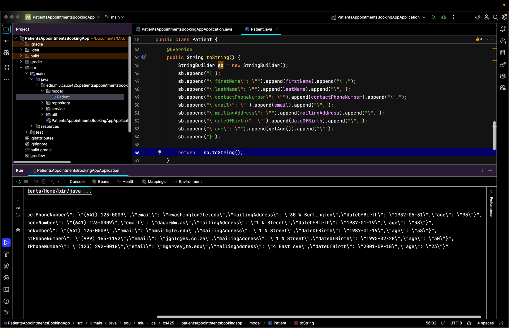
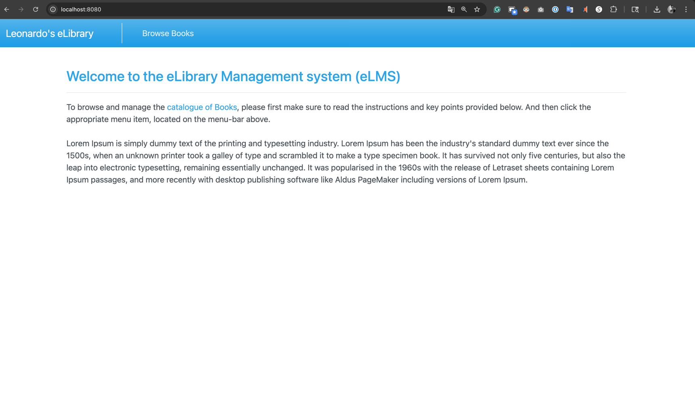
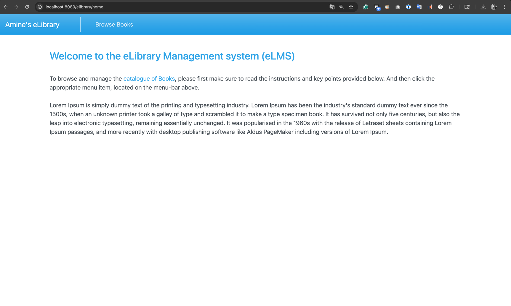

# Assignment 10 A

## PART 1: PAMS screen shots

Patients data into JSON format and print them out to the console, sorted by the Patient’s current Age, in descending order 

________

## Part 2:

Change the Homepage banner text from "elibrary - ..." to "[Your name]'s elibrary - ...". Then, take a screenshot of the homepage

