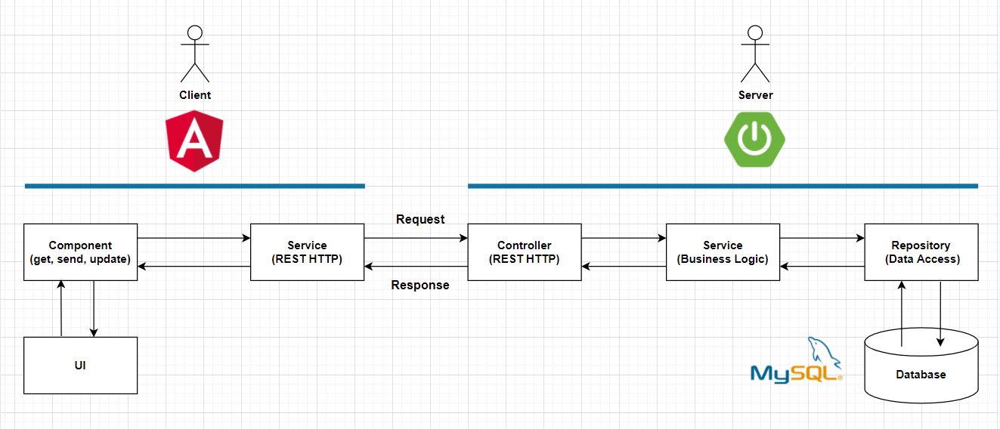
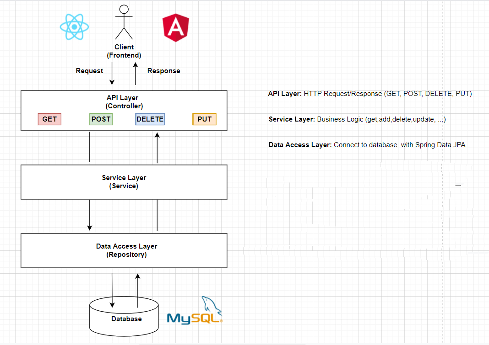

The project follows a standard layered architecture, which promotes separation of concerns and modularity. The main layers are:

1. Controller Layer (controller):

- Handles HTTP requests and responses.
- Maps REST endpoints to service logic.
- Example: ArticleController, UserController.

2- Service Layer (service.impl):

- Contains the core business logic.
- Orchestrates operations across repositories and other services.
- Example: ArticleService, ProfileService.

3- Repository Layer (repository):

- Interfaces with the database using Spring Data JPA.
- Provides CRUD operations on entities.
- Example: ArticleRepository, UserRepository

4- Domain Layer (domain):

- Contains entity classes representing database tables.
- Used directly by JPA repositories and services.
- Example: Article, User, Comment

5- DTO Layer (dto):

- Holds Data Transfer Objects used for input/output operations.
- Helps isolate domain models from external clients.
- Example: ArticleRequest, UserResponse

6- Security Layer (security):

- Manages JWT authentication and current user context.
- Example: JwtAuthenticationFilter, SecurityConfig

7- Configuration Layer (config, autoconfigure):

- Holds configuration classes for Swagger, CORS, and JPA.
- Example: SwaggerConfig, PersistenceConfig

8- Utility & Error Handling (util, error):

- Util: contains helpers like SlugUtil, HashUtil.
- Error: handles global exception responses and validation errors.

### 5.3 Technologies Used

Backend:

- Java 11
- Spring Boot 2.5.7
- Spring Data JPA
- Spring Security (JWT-based)
- Lombok
- MySQL
- H2 (dev database)
- Swagger (Springfox 3.0.0)

Frontend:

- Angular 16
- Nx Workspace
- RxJS & NgRx
- TypeScript
- Storybook
- Jest & Cypress
- Firebase Tools (deployment)

### 5.4 Layer Descriptions

- Presentation Layer: Handles incoming HTTP requests using controllers. It exposes REST APIs and maps them to appropriate services.
- Service Layer: Contains business logic. It processes data, applies rules, and coordinates between the controller and repository layers.
- Data Access Layer: Uses Spring Data JPA to interact with the database. It provides CRUD operations through repositories.
- Database: MySQL is used as the main relational database to persist all entities like users, articles, comments, etc.

### 5.5 Frontend (client) communicate with backend (server)

