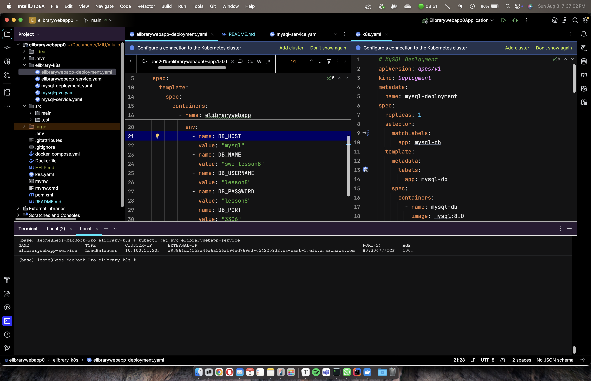
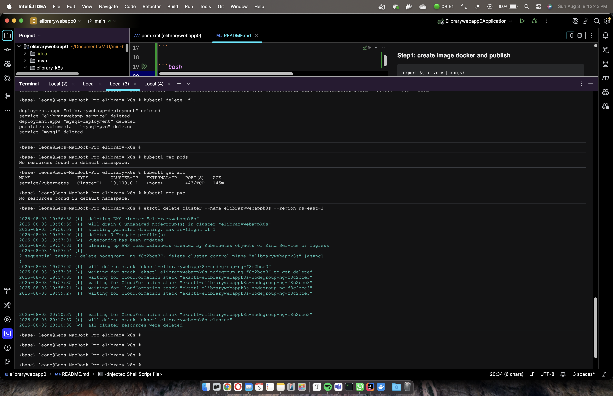

### Step1: create image docker and publish

```bas
export $(cat .env | xargs) 

docker buildx build --platform linux/amd64,linux/arm64 \
-t leone2015/elibrarywebapp0-app:1.0.0 --push .
```

## Step 2: Cluster creation on EKS


```bash
eksctl create cluster --name elibrarywebappk8s --version 1.33 --nodes=1 --node-type=t2.small --region us-east-1
```

```bash
aws eks --region us-east-1 update-kubeconfig --name elibrarywebappk8s   
```

1. Cluster connection:

   ```bash
   kubectl config current-context
   ```

2. Applied resources:

   ```
   kubectl apply -f .
   ```

3. State verification :

   ```
   kubectl get pods
   kubectl get svc
   ```

4. EKS:  wait until LoadBalancer gets Public IP (1–2 min):

   ```
   kubectl get svc elibrarywebapp-service
   ```


### EKS validation running services 

### EKS external-ip

#### EKS cluster deleted



